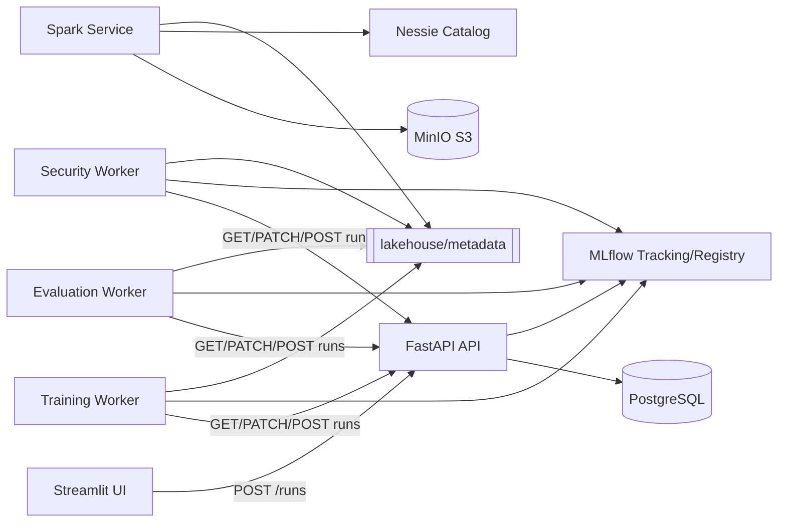
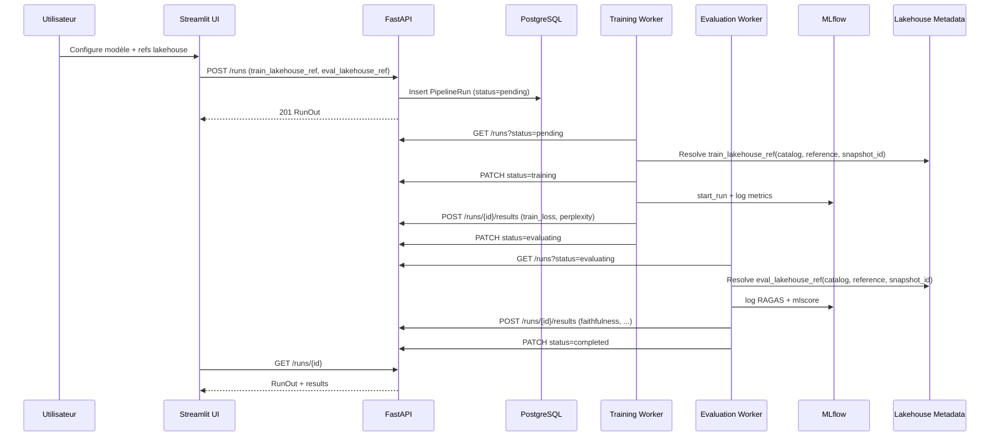
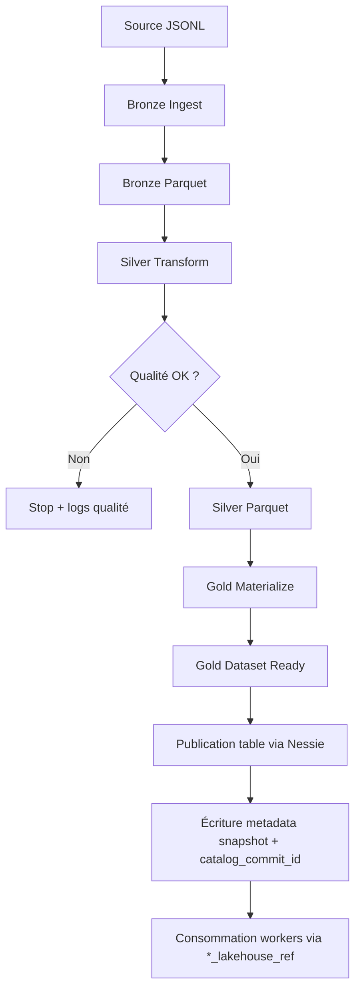
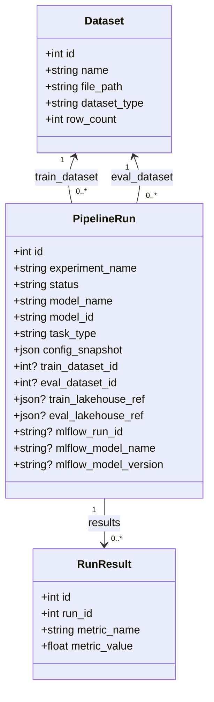

# Schémas UML — Architecture MLOps

Ce document centralise les schémas UML du projet pour faciliter la compréhension globale et les revues d'architecture.

## 1) Diagramme de composants

## 2) Diagramme de séquence — Run `finetune` (lakehouse snapshot)

## 3) Diagramme d'activités — Pipeline Medallion

## 4) Diagramme de classes — Modèle de run (simplifié)

