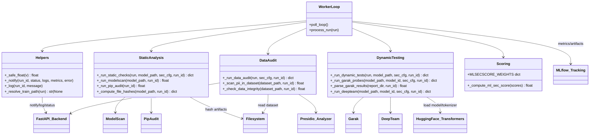
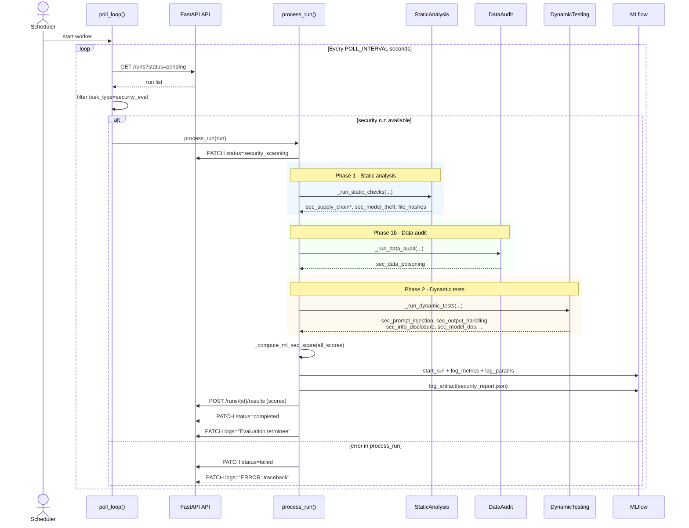
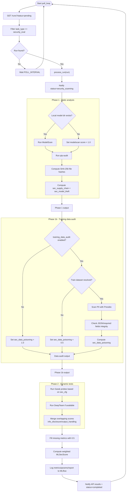

# Security Worker - Diagrammes Mermaid

## Diagramme de structure (Class Diagram)

```mermaid
classDiagram
    class WorkerLoop {
      +poll_loop()
      +process_run(run)
    }

    class Helpers {
      +_safe_float(v) float
      +_notify(run_id, status, logs, metrics, error)
      +_log(run_id, message)
      +_resolve_train_path(run) str|None
    }

    class StaticAnalysis {
      +_run_static_checks(run, model_path, sec_cfg, run_id) dict
      +_run_modelscan(model_path, run_id) float
      +_run_pip_audit(run_id) float
      +_compute_file_hashes(model_path, run_id) dict
    }

    class DataAudit {
      +_run_data_audit(run, sec_cfg, run_id) dict
      +_scan_pii_in_dataset(dataset_path, run_id) float
      +_check_data_integrity(dataset_path, run_id) float
    }

    class DynamicTesting {
      +_run_dynamic_tests(run, model_path, sec_cfg, run_id) dict
      +_run_garak_probes(model_path, model_id, sec_cfg, run_id) dict
      +_parse_garak_results(report_dir, run_id) float
      +_run_deepteam(model_path, model_id, sec_cfg, run_id) dict
    }

    class Scoring {
      +_compute_ml_sec_score(scores) float
      +MLSECSCORE_WEIGHTS dict
    }

    class FastAPI_Backend
    class MLflow_Tracking
    class ModelScan
    class PipAudit
    class Presidio_Analyzer
    class Garak
    class DeepTeam
    class Filesystem
    class HuggingFace_Transformers

    WorkerLoop --> Helpers
    WorkerLoop --> StaticAnalysis
    WorkerLoop --> DataAudit
    WorkerLoop --> DynamicTesting
    WorkerLoop --> Scoring

    Helpers --> FastAPI_Backend : notify/log/status
    StaticAnalysis --> ModelScan
    StaticAnalysis --> PipAudit
    StaticAnalysis --> Filesystem : hash artifacts
    DataAudit --> Presidio_Analyzer
    DataAudit --> FastAPI_Backend : resolve dataset
    DataAudit --> Filesystem : read dataset
    DynamicTesting --> Garak
    DynamicTesting --> DeepTeam
    DynamicTesting --> HuggingFace_Transformers : load model/tokenizer
    WorkerLoop --> MLflow_Tracking : metrics/artifacts
```

## Diagramme de sequence

```mermaid
sequenceDiagram
    actor Scheduler
    participant Poll as poll_loop()
    participant API as FastAPI API
    participant Proc as process_run()
    participant Static as StaticAnalysis
    participant Audit as DataAudit
    participant Dyn as DynamicTesting
    participant MLF as MLflow

    Scheduler->>Poll: start worker
    loop Every POLL_INTERVAL seconds
        Poll->>API: GET /runs?status=pending
        API-->>Poll: run list
        Poll->>Poll: filter task_type=security_eval

        alt security run available
            Poll->>Proc: process_run(run)
            Proc->>API: PATCH status=security_scanning

            rect rgb(240, 248, 255)
                Note over Proc,Static: Phase 1 - Static analysis
                Proc->>Static: _run_static_checks(...)
                Static-->>Proc: sec_supply_chain*, sec_model_theft, file_hashes
            end

            rect rgb(245, 255, 245)
                Note over Proc,Audit: Phase 1b - Data audit
                Proc->>Audit: _run_data_audit(...)
                Audit-->>Proc: sec_data_poisoning
            end

            rect rgb(255, 250, 240)
                Note over Proc,Dyn: Phase 2 - Dynamic tests
                Proc->>Dyn: _run_dynamic_tests(...)
                Dyn-->>Proc: sec_prompt_injection, sec_output_handling,<br/>sec_info_disclosure, sec_model_dos, ...
            end

            Proc->>Proc: _compute_ml_sec_score(all_scores)
            Proc->>MLF: start_run + log_metrics + log_params
            Proc->>MLF: log_artifact(security_report.json)
            Proc->>API: POST /runs/{id}/results (scores)
            Proc->>API: PATCH status=completed
            Proc->>API: PATCH logs="Evaluation terminee"
        else error in process_run
            Proc->>API: PATCH status=failed
            Proc->>API: PATCH logs="ERROR: traceback"
        end
    end
```

## Diagramme d'activite

```mermaid
flowchart TD
    A(["Start poll_loop"]) --> B["GET /runs?status=pending"];
    B --> C["Filter task_type == security_eval"];
    C --> D{"Run found?"};

    D -- "No" --> Z["Wait POLL_INTERVAL"];
    Z --> A;
    D -- "Yes" --> E["process_run(run)"];
    E --> F["Notify status=security_scanning"];

    subgraph P1["Phase 1 - Static analysis"]
      P1A{"Local model dir exists?"};
      P1A -- "Yes" --> P1B["Run ModelScan"];
      P1A -- "No" --> P1C["Set modelscan score = 1.0"];
      P1B --> P1D["Run pip-audit"];
      P1C --> P1D;
      P1D --> P1E["Compute SHA-256 file hashes"];
      P1E --> P1F["Compute sec_supply_chain + sec_model_theft"];
    end

    F --> P1A;
    P1F --> G["Phase 1 output"];

    subgraph P1BIS["Phase 1b - Training data audit"]
      DA1{"training_data_audit enabled?"};
      DA1 -- "No" --> DA2["Set sec_data_poisoning = 1.0"];
      DA1 -- "Yes" --> DA3{"Train dataset resolved?"};
      DA3 -- "No" --> DA4["Set sec_data_poisoning = 0.5"];
      DA3 -- "Yes" --> DA5["Scan PII with Presidio"];
      DA5 --> DA6["Check JSON/required fields integrity"];
      DA6 --> DA7["Compute sec_data_poisoning"];
      DA2 --> DA8["Data audit output"];
      DA4 --> DA8;
      DA7 --> DA8;
    end

    G --> DA1;
    DA8 --> H["Phase 1b output"];

    subgraph P2["Phase 2 - Dynamic tests"]
      DY1["Run Garak probes based on sec_cfg"];
      DY2["Run DeepTeam if available"];
      DY3["Merge overlapping scores<br/>info_disclosure/output_handling"];
      DY1 --> DY2;
      DY2 --> DY3;
    end

    H --> DY1;
    DY3 --> I["Fill missing metrics with 0.5"];
    I --> J["Compute weighted MLSecScore"];
    J --> K["Log metrics/params/report to MLflow"];
    K --> L["Notify API results + status=completed"];
    L --> A;
```
